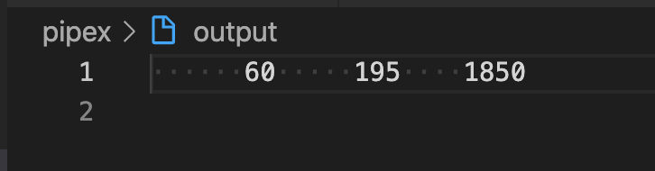

# pipex 100/100 (September 2021)
This is my solution for the pipex project of the Core Curriculum of 42 school.<br>
<br>

## Explanation of my code

This project should recreate all the behavior of the pipe command `|`.<br>
This includes error messages and error handling.<br>
The error messages this code will print are not a exact recreation of those the pipe command will print.<br>
Every of my error messages will tell you what went wrong and after that the error that is stored in errno i.e.<br>
`Command 1 not found: No such file or directory`<br>
his code works with all known special cases that i know of i.e. <br>

```
./pipex pipex.c less /usr/bin/wc output
```

## How to use this code

This will compile the project.<br>

```
make all
```

<br>
This will compile the project and remove every no longer needed `.o` and `.a` files, so you are only left with your executable called `pipex`.<br>
This will also remove the file called `output` if it exists.<br>

```
make call
```

<br>
This is an example on what input to give to run the programm "correctly".<br>

```
./pipex pipex.c less "grep argv" output
```

<br>
The output will be the same as if you run<br>

```
less pipex.c | grep argv > output
```


This is how the output looks for `./pipex pipex.c less "grep argv" output` and `less pipex.c | grep argv > output`<br>
<br>
<br>

## If you find mistakes

As always, if you find mistakes, feel free to open an issue and/or contact me.<br>
